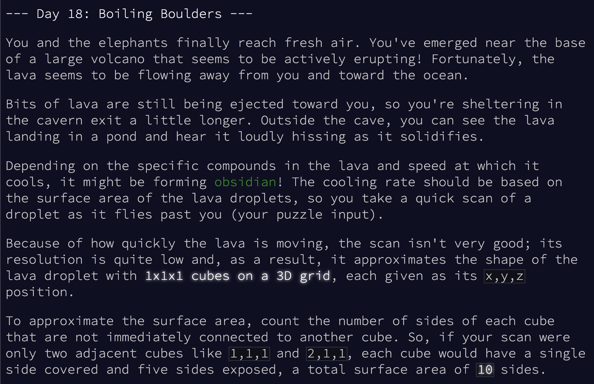
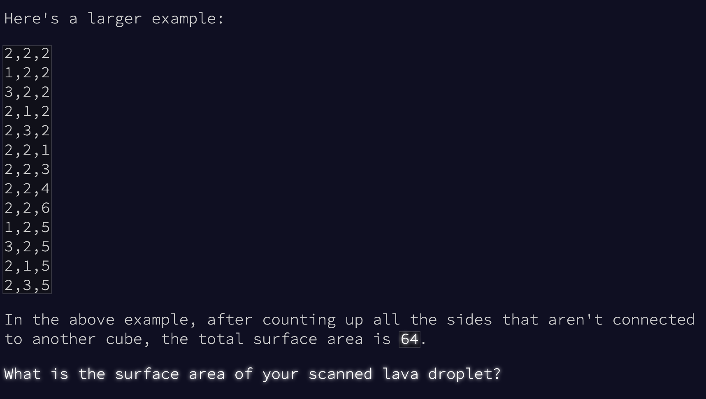
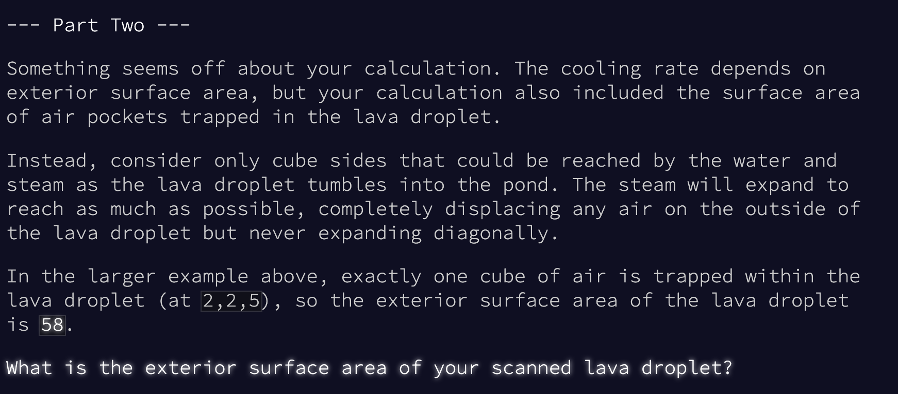
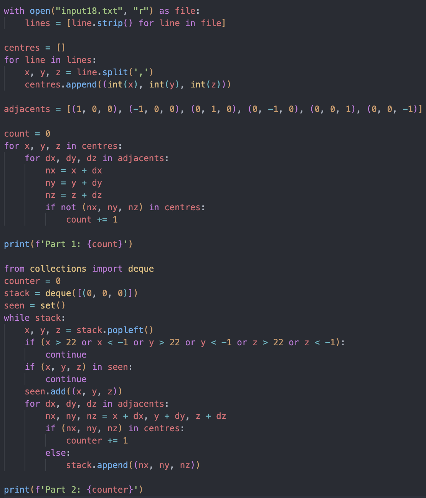

The above files contain both my solutions, input files, any test files and an active working area (currently containing Day 18)

## Active solution run through:

### The provided problem explanation on Advent of Code website

### My Solution
#### - Begin with parsing input
#### - Define six possible adjacent directions
#### - Start with part 1 solution counting each adjacent direction not filled
#### - Adapt part 1 solution to use a popleft double ended queue structure (stack)
#### - Uses a BFS style approach to emulate lava flowing down from [0, 0, 0]

